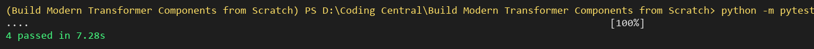
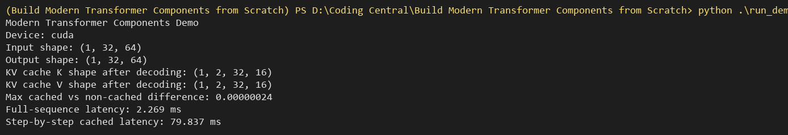
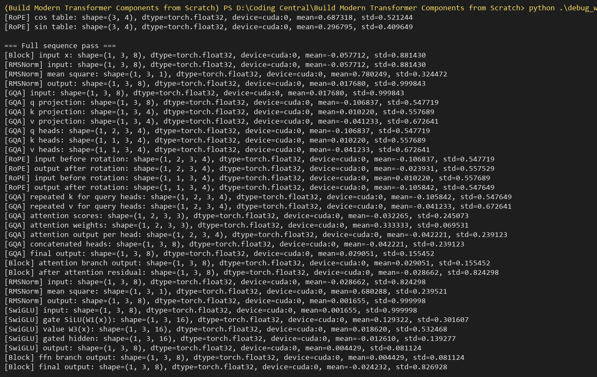
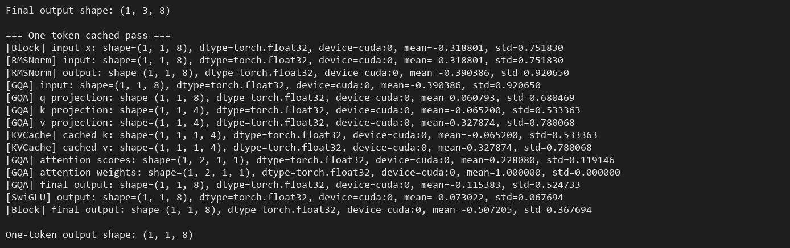

# Benchmark and Verification Report

## Environment

```text
Device: cuda
PyTorch: CUDA build
Python: 3.12
```

The project was verified on GPU using CUDA through PyTorch.

## Test Results

Command:

```powershell
python -m pytest -q
```

Result:

```text
4 passed in 3.95s
```

Screenshot:



## Demo Benchmark

Command:

```powershell
python .\run_demo.py
```

Result:

```text
Modern Transformer Components Demo
Device: cuda
Input shape: (1, 32, 64)
Output shape: (1, 32, 64)
KV cache K shape after decoding: (1, 2, 32, 16)
KV cache V shape after decoding: (1, 2, 32, 16)
Max cached vs non-cached difference: 0.00000024
Full-sequence latency: 1.364 ms
Step-by-step cached latency: 41.190 ms
```

Screenshot:



## Debug Walkthrough Screenshots

The debug walkthrough prints tensor shapes, device placement, dtype, mean, and standard deviation at each major step of the decoder block.

Full sequence pass:



One-token cached pass:



## Component Verification

### RMSNorm

Verified that RMSNorm preserves the input shape and normalizes each token vector to approximately unit root mean square when the scale parameter is initialized to one.

### Rotary Position Embeddings

Verified that RoPE preserves relative distance behavior by comparing dot products at absolute positions and equivalent relative offsets.

### SwiGLU

Verified that the feed-forward network maps from hidden dimension to intermediate dimension and back to the original hidden dimension.

### KV Cache

Verified that autoregressive step-by-step decoding with a KV cache produces numerically equivalent output to full-sequence causal decoding.

### Transformer Decoder Block

Verified that the complete decoder block preserves input/output shape and combines RMSNorm, Grouped-Query Attention, RoPE, KV Cache, SwiGLU, and residual connections.

## Interpretation

The cached and non-cached outputs differ by only `0.00000024`, which is within expected floating-point tolerance. The step-by-step cached latency is higher in this small benchmark because decoding is performed one token at a time in a Python loop. In production generation, KV cache is valuable because it avoids recomputing previous keys and values for every generated token.

## Challenges Faced

- The original implementation had indentation issues that caused methods to be placed outside their classes.
- The local environment initially used a CPU-only PyTorch build.
- GPU execution required installing the CUDA PyTorch build into the correct virtual environment.

## Assumptions

- The implementation focuses on decoder-block components, not full language model training.
- The benchmark uses a small synthetic tensor for fast verification.
- The attention mask is causal for full-sequence comparison.

## Known Limitations

- The benchmark does not measure long-context generation performance.
- The cache uses tensor concatenation for clarity; a production system would usually preallocate cache tensors for better performance.
- The project does not include tokenizer integration or a full model training loop.

## Possible Improvements

- Add mixed precision benchmarking with `torch.float16` or `torch.bfloat16`.
- Add larger sequence-length benchmarks.
- Replace cache concatenation with preallocated cache buffers.
- Add a full stacked decoder model using multiple `TransformerBlock` layers.
